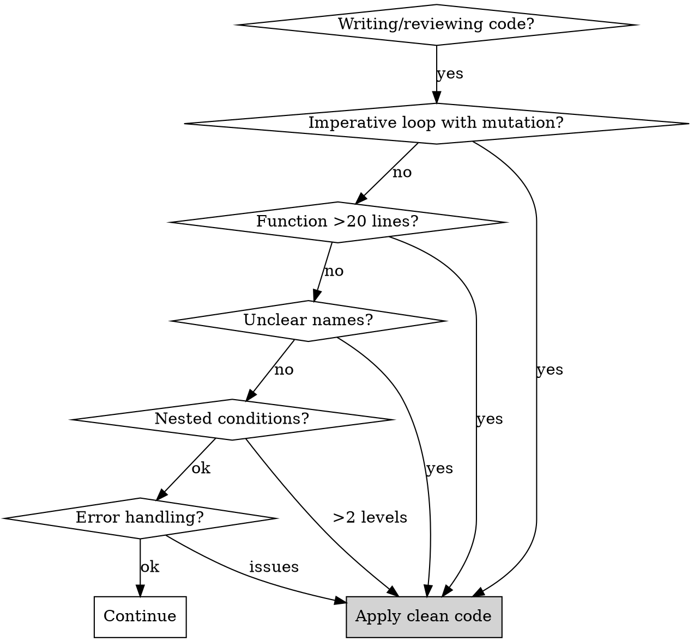

# Clean Code Standards

## Overview

**Code should be declarative, readable, and self-documenting.**

Describe *what* you want, not *how* to get there. Reduce cognitive load for the next reader (including your future self). Functions should do one thing, names should reveal intent, and error handling should be deliberate.

## Core Principles (Priority Order)

1. **Declarative over imperative.** Prefer `filter`, `map`, `reduce` over `for` loops that mutate state.
2. **Early returns.** Handle edge cases and guard clauses at the top. Never nest happy-path logic inside conditionals.
3. **Helper functions.** Extract any logic that needs a comment into a named helper. The name is the comment.
4. **No side effects.** Functions take inputs, return outputs. Avoid mutating arguments or shared state.
5. **Readable over clever.** If two approaches perform similarly, pick the one a junior dev understands without explanation.
6. **One thing per function.** Single Responsibility. <20 lines ideal.
7. **Intention-revealing names.** No `data`, `temp`, `result`, `handle`.

## When to Use



**Trigger symptoms:**
- `for` loops mutating accumulator variables
- Nested `if` blocks for happy-path logic
- Functions longer than 20-30 lines
- Names like `data`, `list`, `process`, `handler`, `x`, `temp`
- Try/catch blocks with just `console.log(e)`
- Conditions nested 3+ levels deep
- Methods with 5+ parameters
- Comments explaining WHAT code does (instead of WHY)
- Function signatures with `T[]`, `Array<T>`, `Map<K, V>`, `Set<T>` where the function only reads
- In-place mutations: `arr.sort()`, `arr.push()`, `obj.field = ...`, `Object.assign(target, ...)`
- Object/array literals exposed without `Readonly<>` or `as const`
- Two files/functions that are near-identical and differ only by a name or a single constant
- A block copy-pasted across 2+ files, or repeated 3+ times within one file
- A field triad/group (`fieldA`/`fieldB`/`fieldC`) handled by hand-written parallel statements instead of mapping over a key table
- Code you cannot understand without first scrolling to read another part
- Names that describe mechanism (`loadJsonAsync`, `doStuff`, `processData`) instead of intent (`loadCountryOptions`)
- A function/variable whose purpose is not obvious from its name alone

---

## Part I: Declarative Style (Highest Priority)

**Describe the result, not the steps.** Pure functions composed via array methods beat imperative loops.

```js
// ❌ BAD: Imperative — mutates, nests, uses index loop
function getActiveAdmins(users) {
  let result = [];
  for (let i = 0; i < users.length; i++) {
    if (users[i].active) {
      if (users[i].role === 'admin') {
        result.push(users[i]);
      }
    }
  }
  return result;
}

// ✅ GOOD: Declarative — composed predicates, no mutation
const isActive = (user) => user.active;
const isAdmin = (user) => user.role === 'admin';

const getActiveAdmins = (users) => users.filter(isActive).filter(isAdmin);
```

### Rules

- **No mutation.** Never reassign function parameters or push to externally-scoped arrays.
- **Use `map` for transformations**, `filter` for selections, `reduce` for aggregations, `forEach` only for side effects.
- **Compose small predicates** instead of inline complex conditions.
- **Pure functions only** unless side effects are the explicit purpose.

---

## Part Ia: Immutability & Readonly Types (TypeScript)

**Express immutability in the type system.** Don't trust convention — let the compiler enforce it.

Defaulting to readonly types makes mutation a deliberate decision (you must opt out) instead of an accident (you must remember not to). Callers receive a contract: "I will not modify this." Future maintainers get a compile error before they introduce a bug, not a runtime surprise after it ships.

### Rules

- **`ReadonlyArray<T>` over `T[]` and `Array<T>`** for function parameters and return types. Default to readonly.
- **`ReadonlyMap<K, V>` over `Map<K, V>`** when the consumer should only `.get()` / `.has()` / iterate.
- **`ReadonlySet<T>` over `Set<T>`** when the consumer should only check membership.
- **`Readonly<T>` wrapper** for object types where every field should be immutable from the consumer's perspective.
- **`readonly` on properties** of one-off inline object types when the value should never be reassigned after construction.
- **`as const`** for literal-type narrowing of arrays, tuples, and object literals you don't intend to mutate.

### Examples

```typescript
// ❌ BAD: Mutable types invite mutation, hide intent
const sumPrices = (items: Item[]): number => {
  items.sort((a, b) => a.price - b.price)  // mutates caller's array!
  return items.reduce((sum, i) => sum + i.price, 0)
}

const buildIndex = (rows: Row[]): Map<string, Row> =>
  new Map(rows.map((r) => [r.id, r]))

const config: { retries: number; timeout: number } = { retries: 3, timeout: 5000 }
config.retries = 5  // surprise mutation

// ✅ GOOD: Readonly contract — compiler stops accidental mutation
const sumPrices = (items: ReadonlyArray<Item>): number =>
  [...items]
    .sort((a, b) => a.price - b.price)
    .reduce((sum, i) => sum + i.price, 0)

const buildIndex = (rows: ReadonlyArray<Row>): ReadonlyMap<string, Row> =>
  new Map(rows.map((r) => [r.id, r]))

const config: Readonly<{ retries: number; timeout: number }> = { retries: 3, timeout: 5000 }
// config.retries = 5  // ❌ TS error: Cannot assign to 'retries' because it is a read-only property

const STATUSES = ['active', 'archived', 'deleted'] as const
type Status = (typeof STATUSES)[number]  // 'active' | 'archived' | 'deleted'
```

### Function Parameters

Accepting `ReadonlyArray<T>` is a strict superset of accepting `T[]` — callers can pass either. Returning `ReadonlyArray<T>` tells callers they must not mutate. Pick the loosest input and the strictest output.

```typescript
// Accepts mutable AND readonly arrays. Returns a contract: "do not mutate me."
const filterActive = (users: ReadonlyArray<User>): ReadonlyArray<User> =>
  users.filter((u) => u.active)
```

### When You Must Mutate

If you must mutate (legitimate side effect, performance hot path, library API requires it), make it loud:
- Confine the mutation to a small, named helper.
- Document why in a comment with the constraint (perf measurement, library requirement, etc.).
- Don't expose mutable references across module boundaries.

### Mutation Smells to Catch in Review

| Smell | Fix |
|-------|-----|
| Function takes `T[]`, doesn't push or reassign | Switch to `ReadonlyArray<T>` |
| Function returns `Map<K, V>` for read-only consumers | Return `ReadonlyMap<K, V>` |
| Object literal type used as a constants table | Wrap in `Readonly<>` or use `as const` |
| `arr.sort(...)` / `arr.reverse(...)` / `arr.splice(...)` on a function param | Copy first: `[...arr].sort(...)` |
| `obj.field = value` where `obj` is a parameter | Return a new object: `{ ...obj, field: value }` |
| `Object.assign(target, ...)` mutating `target` | Use spread: `{ ...target, ...patch }` |
| Module-level `let` array filled by side effects | Build via `map`/`filter`/`reduce` and export `const` |

### Why It Matters

Mutation is the most common source of "spooky action at a distance" bugs: a function modifies a value its caller didn't expect, downstream code reads the modified value, and the cause is invisible at the call site. Readonly types push that risk to compile time. They cost nothing at runtime — TypeScript erases them — but they catch a class of bugs that no amount of test coverage reliably catches.

---

## Part Ib: Duplication (DRY) — Nested, Structural & Copy-Paste

**One behaviour, one source of truth.** Duplication is the most expensive smell to leave in: every future edit must be found and applied N times, and the copies silently drift. Hunt it across files, not just within one function.

### Three kinds to catch

1. **Literal copy-paste** — the same block pasted in two places. Extract a named function.
2. **Near-identical siblings** — two files/functions that differ only by a name or a single constant. Parameterize, don't fork. The classic tell: you can normalize the two with a find-replace and the diff is empty.
3. **Structural / shotgun repetition** — the same shape written out by hand for each member of a group (`fieldA`, `fieldB`, `fieldC`), or the same change scattered across many call sites. Replace with a key table + `map`/`forEach`.

### The Rule of Three

Two occurrences: note it. Three: extract. Do not pre-abstract a single use, but the moment a third copy appears, stop and unify the first two as well.

### Near-identical siblings — parameterize, don't fork

```typescript
// ❌ BAD: two files, identical except one constant and the exported name
// basic/date-options.ts
const MAX = BASIC_MAX_MONTHS
export const generateBasicDateOptions = (): ReadonlyArray<Option> => buildOptions(MAX)
// pro/date-options.ts  ← copy-paste of the above, MAX swapped
const MAX = PRO_MAX_MONTHS
export const generateProDateOptions = (): ReadonlyArray<Option> => buildOptions(MAX)

// ✅ GOOD: one parameterized source of truth
// date/date-options.ts
export const generateMonthlyDateOptions = (
  { maxMonths }: { maxMonths: number },
): ReadonlyArray<Option> => buildOptions(maxMonths)
// each caller: generateMonthlyDateOptions({ maxMonths: PRO_MAX_MONTHS })
```

Review test: *"Could I delete one of these files by passing a parameter to the other?"* If yes, it is a fork, not two features.

### Structural repetition — map over a table

```typescript
// ❌ BAD: the same three lines per field, copy-pasted
const isEmailDisabled = preferences.email === OFF
const isSmsDisabled = preferences.sms === OFF
const isPushDisabled = preferences.push === OFF

// ✅ GOOD: one rule, applied over the members
const CHANNELS = ['email', 'sms', 'push'] as const
const disabledByChannel = Object.fromEntries(
  CHANNELS.map((key) => [key, preferences[key] === OFF]),
) as Record<(typeof CHANNELS)[number], boolean>
```

### How to spot it in review

- Normalize names/constants between two suspect files; if the diff vanishes, they are duplicates.
- A `forEach`/`map` body and a hand-written block elsewhere doing the same step.
- A constant defined twice that differs in one field (e.g. a `default` and a `reset` literal) — name the difference, share the rest.
- Edits that require touching the "same" logic in 3+ files — the logic wants one home.

---

## Part II: Early Returns & Flat Code

**Guard clauses first. Happy path unindented.**

```js
// ❌ BAD: Nested happy path
function processUser(user) {
  if (user) {
    if (user.active) {
      if (user.email) {
        return sendEmail(user);
      }
    }
  }
  return null;
}

// ✅ GOOD: Guards return early, happy path is flat
function processUser(user) {
  if (!user) return null;
  if (!user.active) return null;
  if (!user.email) return null;

  return sendEmail(user);
}
```

**Rule:** If you nest happy-path logic >1 level inside a conditional, extract or invert with early return.

### Sequential `if` blocks (ifs after ifs)

A run of independent `if` blocks back-to-back is its own smell, distinct from nesting. Diagnose by what they do:

- **Each branch dispatches on the same value** → replace the `if/else if` chain with a lookup table or handler map (Open/Closed, see Part V).
- **Each branch is a precondition** → convert to stacked guard clauses with early returns.
- **Each branch repeats the same shape on a different field** → map over a key table (Part Ib, structural repetition).
- **A branch hides a multi-step job** → extract a named helper; the call site reads as a sentence.

```typescript
// ❌ BAD: ifs after ifs, each dispatching on the same key
if (type === 'credit') return new CreditHandler()
if (type === 'paypal') return new PaypalHandler()
if (type === 'sepa') return new SepaHandler()

// ✅ GOOD: lookup table, one source of truth, trivially extensible
const HANDLERS: Record<PaymentType, () => Handler> = {
  credit: () => new CreditHandler(),
  paypal: () => new PaypalHandler(),
  sepa: () => new SepaHandler(),
}
const handler = HANDLERS[type]()
```

**Rule:** 3+ sibling `if` blocks branching on one value → lookup/dispatch table. A condition you cannot read at a glance → name it with a predicate (`isEligible(user)`), not a comment.

---

## Part III: Naming Conventions

**Names should reveal intent and be self-documenting.**

```typescript
// ❌ BAD
const d = new Date();
const list = getItems();
function process(x) { ... }

// ✅ GOOD
const orderCreatedAt = new Date();
const activeCustomers = getActiveCustomers();
function calculateOrderTotal(order) { ... }
```

| Type | Convention | Example |
|------|------------|---------|
| Boolean | `is`, `has`, `can`, `should` prefix | `isActive`, `hasPermission`, `canDelete` |
| Function | Verb + noun | `calculateTotal`, `validateEmail` |
| Collection | Plural noun | `users`, `orderItems` |
| Constants | SCREAMING_SNAKE_CASE | `MAX_RETRY_COUNT` |
| Classes | PascalCase noun | `OrderProcessor` |

**Avoid:** `data`, `result`, `info`, `temp`, `handle*`, `manage*`. Be specific.

---

## Part IV: Function Size & Single Responsibility

**Functions do one thing. <20 lines ideal.** Extract via helper functions — the helper name replaces the comment.

```typescript
// ❌ BAD: Does validation, calculation, discounts, notifications, inventory
function processOrder(order) {
  if (!order.items) throw new Error('No items');
  // ... 50+ more lines
}

// ✅ GOOD: Each helper is one thing
function processOrder(order) {
  validateOrder(order);
  const subtotal = calculateSubtotal(order);
  const total = applyDiscounts(order, subtotal);
  notifyCustomer(order);
  updateInventory(order);
  return { total };
}

const calculateSubtotal = (order) =>
  order.items.reduce((sum, item) => sum + item.price * item.quantity, 0);
```

| Lines | Action |
|-------|--------|
| 1-20 | OK |
| 21-30 | Consider splitting |
| 31-50 | Split |
| 50+ | Must refactor |

---

## Part V: SOLID Principles

### S — Single Responsibility
One class/function = one reason to change. Split `UserService` that emails, reports, and validates into `UserService` + `EmailService` + `UserReportGenerator` + `PasswordValidator`.

### O — Open/Closed
Extend via new classes/functions, not by modifying existing ones. Replace `if (type === 'credit') ... else if (type === 'paypal')` chains with a handler registry.

### L — Liskov Substitution
Subtypes must honor base type contracts. `Square extends Rectangle` overriding `setWidth` to also set height violates LSP — model as separate `Shape` implementations.

### I — Interface Segregation
Many small interfaces > one fat interface. `Workable`, `Eatable`, `Meetable` instead of one `Worker` with 4 methods.

### D — Dependency Inversion
Depend on abstractions. Inject `Database` interface; don't `new MySQLDatabase()` inside business logic.

---

## Part VI: Code Smells

| Smell | Solution |
|-------|----------|
| Long Method (>20 lines) | Extract methods |
| Long Parameter List (>3-4) | Parameter object |
| Feature Envy (uses other class's data) | Move method to that class |
| God Class | Split into focused classes |
| Primitive Obsession | Create value objects |
| Duplicate Code | Extract to shared function |
| Dead Code | Delete it |
| Comments explaining WHAT | Rename / restructure |
| Functions with `and` in name | Split into separate functions |
| `for` loop with mutation | `map`/`filter`/`reduce` |

### Long Parameter List → Parameter Object

```typescript
// ❌ BAD
function createUser(name, email, age, address, city, country, phone, isAdmin, department) { ... }

// ✅ GOOD
function createUser(params: { name: string; email: string; age: number; address: Address; phone: string; role: UserRole }) { ... }
```

---

## Part VII: Error Handling

**Handle errors deliberately. Never swallow.**

```typescript
// ❌ BAD: Swallowed
try { await processPayment(); } catch (e) { console.log(e); }

// ❌ BAD: Lost context
try { await processPayment(); } catch (e) { throw new Error('Payment failed'); }

// ✅ GOOD: Specific handling, re-throw unexpected
try {
  await processPayment();
} catch (error) {
  if (error instanceof PaymentDeclinedError) {
    return { success: false, reason: 'payment_declined' };
  }
  if (error instanceof InsufficientFundsError) {
    return { success: false, reason: 'insufficient_funds' };
  }
  throw error;
}
```

| Do | Don't |
|----|-------|
| Catch specific exceptions | Catch-all |
| Preserve stack trace | Swallow context |
| Re-throw unexpected | Silent failure |
| Log with context | `console.log(e)` |

---

## Part VIII: Comments

**Self-documenting code first. Comments explain WHY, not WHAT.**

```typescript
// ❌ BAD: Explains what
// Loop through items and add prices
for (const item of items) { total += item.price; }

// ❌ BAD: Compensates for bad naming
// Check if user can access admin panel
if (u.r === 1) { ... }

// ✅ GOOD: Explains business rule
// VAT is calculated at checkout per finance requirement FR-2341
const subtotal = items.reduce((sum, i) => sum + i.price, 0);

// ✅ GOOD: Explains non-obvious decision
// Insertion sort: arrays typically <10 items, beats quicksort at small n
insertionSort(items);
```

**Appropriate:** business rules, legal/compliance, consequence warnings, non-obvious decisions, API docs.
**Inappropriate:** explaining what code does, compensating for naming, commented-out code, TODOs without ticket.

### Replace the comment with a name

When you reach for a comment to explain *what* a line or block does, that is the signal to rename or extract instead. The name becomes the documentation and cannot drift out of date.

```typescript
// ❌ BAD: comment carries the meaning the code should
// only trial users on the team plan see the onboarding banner
if (u.plan === 'TEAM' && u.status === 'TRIAL') { showOnboarding() }

// ✅ GOOD: the predicate name IS the comment
if (isTrialTeamUser(u)) { showOnboarding() }
```

A comment that restates the next line is dead weight. A comment that decodes a cryptic name (`// the retry count`) means the name is wrong — fix the name (`retryCount`). Function names must say what the function does in domain terms; avoid mechanism-named functions (`loadJsonAsync`, `processData`) and generic `handle*`/`manage*`.

---

## Quick Reference

| Symptom | Fix |
|---------|-----|
| `for` loop mutating accumulator | `filter`/`map`/`reduce` |
| Nested happy path | Early returns |
| Function >20 lines | Extract helpers |
| Parameters >4 | Parameter object |
| `data`/`result`/`temp` | Descriptive name |
| `catch (e) { console.log(e) }` | Handle or re-throw |
| Comment explains WHAT | Rename or restructure |
| Nesting >3 levels | Early returns + extraction |
| Class >200 lines | Split responsibilities |
| Inline complex condition | Named predicate function |
| `T[]` / `Array<T>` parameter that is not mutated | `ReadonlyArray<T>` |
| `Map<K, V>` returned for read-only consumption | `ReadonlyMap<K, V>` |
| Mutable object literal type used as a constants table | `Readonly<T>` or `as const` |
| `arr.sort(...)` / `arr.push(...)` on a function param | Copy first or build new array |
| Two near-identical sibling files (differ by one name/const) | Parameterize into one shared function |
| Same block copy-pasted across files | Extract to a shared module |
| Field triad (`a`/`b`/`c`) handled by parallel statements | Map over a key table |
| 3+ sibling `if` blocks branching on one value | Lookup / dispatch table |
| `if` after `if` of preconditions | Stacked guard clauses + early return |
| Comment restates the next line | Delete it |
| Comment explains a cryptic name | Rename the symbol |
| Function named by mechanism (`loadJsonAsync`) | Rename to intent (`loadCountryOptions`) |
| Can't understand a line without scrolling elsewhere | Extract + rename until it reads locally |

## Severity

| Level | Indicators | Action |
|-------|------------|--------|
| CRITICAL | God class, SRP violation, error swallowing, mutation of inputs, in-place mutation of caller-owned data | Fix before merge |
| HIGH | Methods >50 lines, >5 params, feature envy, imperative loops, mutable types where readonly suffices, structural duplication across files (near-identical sibling files / copy-pasted blocks) | Should fix |
| MEDIUM | Methods 20-50 lines, unclear naming, mechanism-named functions, comments standing in for names, sequential-`if` chains that want a lookup table, repeated field triads, minor SOLID issues, missing `Readonly<>` on exposed object types | Consider fixing |
| LOW | Style polish, doc opportunities, prefer `as const` for static literal tables, comment restating the next line | Optional |

## Red Flags — Stop and Refactor

| About to... | Ask... |
|-------------|--------|
| Write `for (let i = 0; ...)` | Can I use `filter`/`map`/`reduce`? |
| Add 5th parameter | Parameter object? |
| Add 30th line to function | Extract a method? |
| Name variable `data` or `result` | What does this represent? |
| Write `catch (e) { }` | What should happen on error? |
| Write comment explaining code | Can I rename to make it obvious? |
| Nest 4th level of conditions | Early returns? Extract? |
| Mutate a parameter | Return a new value instead |
| Type a parameter as `T[]` / `Array<T>` | Use `ReadonlyArray<T>` unless mutation is intentional |
| Return `Map<K, V>` from a query/loader | Return `ReadonlyMap<K, V>` |
| Type a config/options object as plain `{...}` | Wrap in `Readonly<>` or use `as const` |
| Call `.sort()` / `.push()` / `.splice()` on a parameter | Copy first or build a new collection |
| Copy a file/function and tweak one name or constant | Parameterize the original instead |
| Write a 3rd near-identical branch or field block | Build a key table and `map` over it |
| Write `if` then another `if` on the same value | Lookup / dispatch table |
| Write a comment explaining what the next line does | Rename or extract until it is obvious |
| Name a function `fooAsync` / `doStuff` / `handleX` | Name it by what it does in domain terms |

## Common Rationalizations

| Excuse | Reality |
|--------|---------|
| "Imperative is faster" | Modern engines optimize array methods. Readability > micro-perf. |
| "It's just a small function" | Small today, large tomorrow |
| "Name is obvious in context" | Context changes, readers differ |
| "I'll refactor later" | Later never comes |
| "It's just logging the error" | Silent failures cause prod incidents |
| "Comments make it clearer" | Good names + structure are clearer |
| "Only 25 lines" | Each line over 20 adds cognitive load |
| "Breaking up adds overhead" | Function call overhead negligible |
| "Mutation is simpler here" | Mutation is the source of most bugs |
| "`ReadonlyArray` is just typing noise" | Compile-time guardrail catches a class of bugs tests don't. Zero runtime cost. |
| "I'll only mutate it once" | Once becomes habit. Mutable types invite mutation; readonly types document intent. |
| "It's an internal helper" | Internal today, exported tomorrow. Default to readonly anyway. |
| "Faster to copy-paste than abstract" | You pay that shortcut back at every future edit, ×N copies, plus the drift bugs. |
| "It's only two copies" | Two become three. Unify at the second; the third never gets cheaper. |
| "The copies might diverge later" | Divergence is a new parameter, not a fork. Parameterize; split only if they truly diverge. |
| "The comment explains it fine" | Comments drift; names don't. If it needs a comment to read, rename or extract. |
| "ifs after ifs are clearer" | A chain on one value is a table in disguise. The table is shorter and extensible. |
