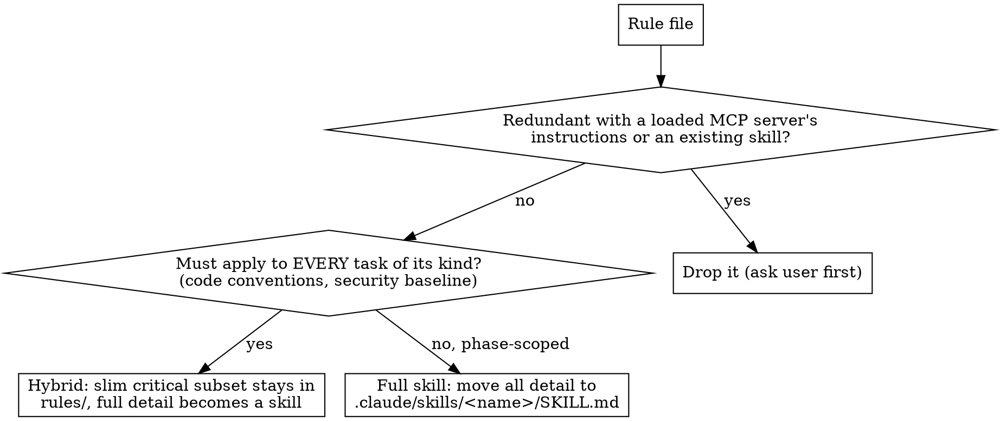

# optimize-agent-md

## Overview

Audit, slim, and split a project's root agent-config file (`CLAUDE.md`, `AGENTS.md`, `GEMINI.md`, or equivalent) plus any existing rules directory into a router + per-area rule files. Detect rules that were copy-pasted from another repo and no longer apply. Reorganize survivors into a router pattern so heavy detail loads on demand instead of at every conversation start.

Works across agent ecosystems. Auto-detects the agent flavor from filenames and rewrites the right tree (`.claude/rules/`, `.agents/rules/`, `.gemini/rules/`).

For Claude Code repos there is an optional further step: promote rule files into **skills** (`.claude/skills/<name>/SKILL.md`) so the guidance activates itself by task relevance and is `/name`-invocable, instead of depending on the agent remembering to read a router link. See "Optionally promote rules to skills" below. This is the more impactful evolution when a repo has fat, topic-shaped rule files.

**Core principle:** wrong rules are worse than no rules. Hallucinated constraints (libraries that are not installed, paths that do not exist) waste tokens and produce broken suggestions. Verify every claim against the current repo before keeping it.

## When to use

- User explicitly invokes the skill name or asks to:
  - "Optimize CLAUDE.md" / "optimize AGENTS.md" / "optimize GEMINI.md"
  - "Audit / split / refactor my agent config file"
  - "Reorganize `.claude/rules/`" / "`.agents/rules/`"
  - "Make my agent config a router"
  - "Convert my rules into skills" / "promote rules to skills" / "make my rules auto-discoverable" (Claude Code)
  - "Revive / fix my dormant skills" (flat `.claude/skills/*.md` files that never trigger)
- A repo has a single huge root config (>200 lines) that loads on every turn.
- Rules in the root file or `*/rules/` reference libraries, paths, or workflows that the user has confirmed are wrong.

## When NOT to use

- Auto-invocation. Manual only. Do not run because you happened to read the root config file.
- Single short root file (<80 lines) with no stale content. Split adds discovery burden for no gain.
- Project explicitly relies on one flat file by convention.

## Workflow

Follow in order. Do not skip the audit step.

### 0. Detect agent flavor

Pick the target tree based on which root file(s) exist:

| Root file present | Rules dir to write |
|---|---|
| `CLAUDE.md` only | `.claude/rules/` |
| `AGENTS.md` only | `.agents/rules/` |
| `GEMINI.md` only | `.gemini/rules/` |
| Multiple present | Ask user which to optimize. Do not split into multiple trees in one run. |
| None of the above, but the user named one | Use the one named. |
| None present, no name | Stop. Ask the user which file to optimize. |

If both `CLAUDE.md` and `AGENTS.md` exist and the user is ambiguous, default to `CLAUDE.md` + `.claude/rules/` only if the project is clearly Claude Code (presence of `.claude/`, `.claude-plugin/`, `claude` in scripts). Otherwise ask.

Variables used below:
- `ROOT_FILE` = the chosen root file (e.g. `CLAUDE.md`).
- `RULES_DIR` = the chosen rules directory (e.g. `.claude/rules/`).

### 1. Inventory

Find every relevant file:

```bash
# Root files
find . -maxdepth 4 \( -iname "CLAUDE.md" -o -iname "AGENTS.md" -o -iname "GEMINI.md" -o -iname "agent.md" \) 2>/dev/null

# Existing rules trees
ls -la .claude/rules/ 2>/dev/null
ls -la .agents/rules/ 2>/dev/null
ls -la .gemini/rules/ 2>/dev/null

# Adjacent docs
find docs -maxdepth 3 -type f 2>/dev/null
ls -la CONTEXT.md docs/adr/ 2>/dev/null
```

Read each one fully. Note size in lines per file.

### 2. Audit every claim against the real repo

For each rule, library, command, path, or convention mentioned, verify it matches reality.

| Claim | Verify with |
|---|---|
| Library X is used | `grep -E '"<lib>"' package.json` / `cat go.mod` / `cat pyproject.toml` / equivalent |
| Path `foo/bar/` exists | `ls foo/bar` |
| Command `pnpm run X` works | check `package.json` `scripts` |
| Test framework is Jest/Vitest/Pytest/etc. | check devDependencies + config files |
| Style approach is CSS Modules / SCSS / styled-components / Tailwind | check imports + dependencies |
| State lib is Redux / Zustand / Signals / Pinia | check imports |
| MFE / micro-frontend rules | search for actual MFE infra (single-spa, module federation) |
| External rule file `.github/REVIEW_RULES.md` | `ls` it |
| Slack channel / Linear project / Jira project references | check `.github/` workflows, env files, or ask user |

If a claim cannot be verified, flag it for removal. Common red flags:
- Mentions of `@<org>/shared-*` packages that are not in the manifest.
- Mentions of `apps/*`, `packages/*`, `services/*` directories in a single-package repo.
- Rules referring to "MFE", "MountMicroFrontend", "service-registry", "root-config" with no matching code.
- Slack channel mapping, Sentry projects, infra names from another org.
- Tooling references that don't match (e.g. `eslint` rules listed but project uses Biome / Ruff / ktlint).
- Rules about a language not present in the repo (e.g. Java rules in a Node-only project).

### 3. Categorize survivors

Bucket every rule into one of four categories. If a rule fits two, pick the one that best matches the trigger condition.

| Category | Contents |
|---|---|
| Overall | Approach, working principles, tone, tool preferences (MCP servers, editors), validation-before-end-of-turn, model routing |
| Code | Code style, naming, comments, language-specific rules (TS/JS/Python/Go/Rust/Java/etc.), framework rules (React/Vue/Spring/etc.), styling rules, state management, type modeling |
| Project | Commands (build/test/dev/lint), architecture pointers, env vars, embedding/integration context, E2E setup, build + deploy, local-only artifacts, issue-tracker conventions |
| Review | Blocking + warning rules for PR review, self-validation checklist, conflict resolution |

### 4. Write the four files

Target layout (substitute `RULES_DIR`):

```
<RULES_DIR>/
  overall.md    # Overall approach + tool prefs
  code.md       # Code rules (language + framework specific)
  project.md    # Commands, architecture, build, env, E2E setup
  review.md     # Review rules (blocking + warning + self-validation)
```

Naming note: original layout used `claude.md` inside `.claude/rules/`. For the generic skill use `overall.md` so the same name works under `.agents/rules/` and `.gemini/rules/`. If the existing tree already uses `claude.md` / `agents.md` / `gemini.md`, keep the existing name to avoid churn.

File-size guidance (rough):
- `overall.md`: 50-100 lines
- `code.md`: 100-250 lines (heaviest; project-specific TS / React / Python / etc. rules live here)
- `project.md`: 80-150 lines
- `review.md`: 50-120 lines

If a category is empty, skip the file. Do not write empty stubs.

### 5. Rewrite root `ROOT_FILE` as a router

Keep it short (under 60 lines). Structure (substitute `RULES_DIR` and `ROOT_FILE`):

```markdown
# <ROOT_FILE> (Router)

Minimal entry point. Detailed rules live in `<RULES_DIR>`. Load on demand.

## Precedence

User instructions override this file and every linked rule file.

## When to read what

| Task | File |
|---|---|
| Default overall approach, tool prefs, validation | `<RULES_DIR>overall.md` |
| Writing new features, refactoring, code style | `<RULES_DIR>code.md` |
| Need a command, env var, build step, architecture | `<RULES_DIR>project.md` |
| Doing a code review or PR self-check | `<RULES_DIR>review.md` |
| <docs/* file if present> | `docs/<path>` |

## Quick rules (must follow on every task)

- (3-6 truly always-on rules, no more)

## Reach for files when

- Adding new code -> read `code.md`.
- Reviewing PR -> read `review.md`.
- Need a project command or architecture detail -> read `project.md`.
- Need tool preference or validation steps -> read `overall.md`.

## Local-only artifacts (gitignored)

(only if project has spec-kit / brainstorm / plans / specs trees)

## Plans pointer

(only if a plans dir exists)
```

### 6. Route to `docs/` when present

If `docs/` (or `docs/agents/`, `docs/adr/`, `CONTEXT.md`) exists, add rows to the router table AND triggers to the "Reach for files when" list. Read each doc's first 5 lines to write an accurate description.

Common docs to route:

| Doc | Trigger |
|---|---|
| `docs/agents/issue-tracker.md` | Naming branches / commits, opening tickets |
| `docs/agents/triage-labels.md` | Applying triage labels |
| `docs/agents/domain.md` | Looking up domain terminology |
| `CONTEXT.md` | Looking up domain glossary |
| `docs/adr/` | Checking architectural decisions |

### 7. Surface what was dropped

In your final message to the user, list:
- Files created / modified.
- Rules dropped, with one-line reason each (cite evidence: "no `@x/y` in `package.json`", "no `apps/` dir").
- Rules reworded, with what changed.

User should be able to `git diff` and understand every change.

## Optionally promote rules to skills (Claude Code only)

After (or instead of) the router split, offer to promote rule files into **skills**. A rule file in `.claude/rules/` only activates when something tells the agent to read it (the router link, or the agent guessing). A skill's `name` + `description` sit in the system prompt, so the model pulls the body in by task relevance on its own, and the user can run it as `/name`. For topic-shaped, detail-heavy rules that is a real upgrade; for tiny always-on rules it is not (see hybrid, below).

**Scope guard — Claude Code only.** Skill auto-discovery is a Claude Code feature. Do this only when `RULES_DIR` is `.claude/rules/`. For `.agents/` (Codex) and `.gemini/` (Gemini), stop at the router unless you have confirmed that ecosystem auto-discovers skills the same way; otherwise promoting rules makes them dormant. When unsure, keep the rules and say so.

### Decision per rule file



**Size gate first.** A rule file already short enough to carry no real detail (rough cut: under ~30 lines, phase-scoped) gains nothing from promotion — a skill wrapper just adds a discovery hop. Leave it as a rule. Promote only files whose detail is worth auto-triggering.

**Two forks are the user's call, not yours — ask via one batched question:**
- For each always-on discipline rule: **hybrid** vs **full skill**. Default recommend hybrid. If hybrid, also ask where the critical subset lives (usually a slimmed `rules/<x>.md`, not back in the root file).
- For each redundant rule: **drop** vs **keep as a thin skill**. Default recommend drop.

### The rules that govern the conversion

1. **Discovery format is non-negotiable.** Claude Code discovers a project skill ONLY as a directory: `.claude/skills/<name>/SKILL.md`. A flat `.claude/skills/<name>.md` is **dormant** — never listed, never auto-triggers, not `/name`-invocable. Always emit the directory form.

2. **Migrate existing flat skill files.** Before writing anything, scan `.claude/skills/` for flat `*.md` files. Each is a dormant skill. Revive it: `mkdir -p .claude/skills/<name> && git mv .claude/skills/<name>.md .claude/skills/<name>/SKILL.md` (plain `mv` if untracked). The frontmatter is usually already valid; fix the description per rule 5 if not. This is independent of any rules work — a repo with dormant flats is worth fixing on its own.

3. **Verify discovery live, same session.** After writing a `SKILL.md`, it appears in the available-skills list immediately — no restart. That is your GREEN check: confirm the new skill is listed. A flat file never appears; that is the negative control proving the dir form was required.

4. **Hybrid for always-on disciplines.** A rule that must hold on EVERY task of its kind (code conventions, security baseline) must NOT be fully skillified — if the skill fails to fire, the rule is silently skipped, which is worse than a rule that is always loaded. Keep a short critical subset in `rules/<x>.md` (stays effectively always-on via the router) and move the full detail into the skill. Phase-scoped rules (build/test commands, the review checklist) are safe to fully skillify — they only matter during that phase, so relevance-triggering is correct.

   ```
   .claude/rules/code.md          # slimmed: ~20-40 lines, the non-negotiables only
   .claude/skills/code-conventions/SKILL.md   # full detail, triggers when writing/refactoring code
   ```

5. **Description = trigger, not workflow.** Per skill-authoring conventions, the `description` is third person, starts with "Use when…", lists concrete triggering conditions/symptoms, and NEVER summarizes the skill's process. If the repo's existing skills carry a `triggers:` list in frontmatter, generate that too, to match house style. Bad: "Use when reviewing — checks naming then types then tests." Good: "Use when writing or refactoring TypeScript/React in this repo, before committing code."

6. **Name-collision check.** Skill names share one flat namespace with plugin skills and slash commands. Before naming a skill, check for collisions (other `.claude/skills/`, installed plugin skills, `/` commands). Rename to a non-colliding, still-descriptive name — e.g. a review rule cannot become `code-review` if a `code-review` plugin / `/review` exists; use `review-checklist`.

7. **Check git tracking before claiming sharing impact.** Run `git ls-files .claude/` (or inspect `.gitignore`). If `.claude/` is gitignored, the whole tree is local-only — converting rules to skills loses no team sharing because none existed; say that. If `.claude/` IS tracked, flag that the new skills, like the old rules, will be committed and shared with the team. State the real implication for this repo; do not assume.

8. **Rewire the router.** After conversion the root file must point at the skills, not the deleted rule files, and the intro should say detail now lives in auto-triggering / `/name`-invocable skills (plus the slim hybrid subset in `rules/`). Sweep the repo for stale references to any deleted rule path and fix or flag them. Ignore dated artifacts (old plans/specs) that merely mention the old paths historically.

### Skill body shape (when promoting)

Keep the moved content; do not rewrite the rules. Wrap them in the standard skeleton:

```markdown
---
name: <kebab-name>
description: Use when <concrete triggers/symptoms — no workflow summary>
triggers:        # only if the repo's other skills use this field
  - <symptom 1>
  - <symptom 2>
---

# <Name>

## When to use
<bullets of triggering situations>

<the rule content, moved verbatim from the rule file>
```

## Audit checklist (use this when scanning rules)

For each rule, ask:

- [ ] Does the library/tool/path it references exist in this repo?
- [ ] Does the command it references work (check `scripts` in `package.json` or equivalent)?
- [ ] Does the convention it enforces match what current code actually does (sample 2-3 files)?
- [ ] Is the rule generic-enough-to-survive that it would apply to any project? If yes, it belongs in the user's global agent config (`~/.claude/CLAUDE.md`, `~/.codex/AGENTS.md`, `~/.gemini/GEMINI.md`), not the project file.
- [ ] Is the rule contradicted by another rule in the same file? Flag for resolution.

## Common stale-rule patterns

| Pattern | Action |
|---|---|
| `@<org>/shared-*` library rules | Verify package exists. If not, drop. |
| MFE / `MountMicroFrontend` / `root-config` rules | Verify MFE infra exists. Otherwise drop the entire section. |
| Slack channel mapping rules | Drop unless `.github/` workflows reference Slack. |
| Specific test framework rules (Jest fixtures, Playwright POM, Pytest fixtures) | Verify framework matches. Reword to actual setup. |
| Specific styling library rules (styled-components, emotion, CSS Modules, Tailwind) | Verify dep present. Drop or reword. |
| State management rules (Redux selectors, Zustand stores, Pinia) | Verify lib in deps. Reword to actual lib. |
| `index.ts` barrel file rules | Check if codebase uses them. Keep rule only if convention is followed. |
| Jira/Linear/GitHub Issues references | Verify which tracker is actually used. |
| Language-specific rules for unused language | Drop entire section. |

## Router section template

Copy and adapt (substitute `RULES_DIR`):

```markdown
## When to read what

| Task | File |
|---|---|
| Default overall approach, tool prefs, validation-before-end | `<RULES_DIR>overall.md` |
| Writing new features, refactoring, code style | `<RULES_DIR>code.md` |
| Need a command, env var, build step, architecture pointer | `<RULES_DIR>project.md` |
| Doing a code review or PR self-check | `<RULES_DIR>review.md` |

## Reach for files when

- Adding new code / new feature -> read `code.md`.
- Reviewing a PR or doing self-review -> read `review.md`.
- Need a project command, architecture detail, or env config -> read `project.md`.
- Need tool preference detail or validation steps -> read `overall.md`.
```

## Common mistakes

- **Splitting without auditing.** Carrying stale rules into smaller files just rearranges chairs. Audit first, drop irrelevant rules, then split.
- **Generic content in `overall.md`.** "Be concise", "think before acting" applies to every project and belongs in the user's global agent config. Project-level `overall.md` should still be project-specific approach.
- **Duplicating root content in `project.md`.** Pick one. Recommend: keep architecture in `project.md`, make root file a pure router.
- **Forgetting `docs/` routing.** If the repo has `docs/agents/*`, `CONTEXT.md`, or `docs/adr/`, the router should point there.
- **Empty stubs.** If a category is empty for this project (e.g. no review rules yet), do not write an empty `review.md`. Skip.
- **Hyphens / em-dashes in user-facing output if the project bans them.** Check root file for style rules before writing the final summary message.
- **Mixing agent trees.** Do not split into both `.claude/rules/` and `.agents/rules/` in one run. Pick one target per invocation.
- **Renaming working filenames.** If existing tree uses `claude.md` / `agents.md`, keep it. Do not churn names just to match the generic `overall.md` convention.
- **Writing a flat skill file.** `.claude/skills/<name>.md` is dormant — never discovered. Always the directory form `.claude/skills/<name>/SKILL.md`. Same trap when migrating: must `mkdir` the dir, not leave the `.md` at the skills root.
- **Skipping the flat-file sweep.** A repo can already contain dormant flat skills. Detect and migrate them even if the user only asked about rules.
- **Fully skillifying an always-on rule.** If the skill does not fire, the rule is silently skipped. Use the hybrid pattern (slim subset in `rules/`, full detail in skill) for anything that must hold on every task.
- **Absorbing a redundant rule instead of dropping it.** A rule that just restates a loaded MCP server's instructions or an existing skill should be deleted, not moved into another file. Moving it keeps the duplication.
- **Promoting rules to skills outside Claude Code.** Skill auto-discovery is Claude-specific. For `.agents/` / `.gemini/`, promotion can make rules dormant. Stay at the router unless you confirmed that ecosystem discovers skills.
- **Description that summarizes the workflow.** The model then follows the description and skips the body. Description = triggers only.

## Deliverable shape

Final user message must contain:
1. File inventory before / after with line counts.
2. Table of what was dropped + evidence.
3. Table of what was added or reworded.
4. If rules were promoted to skills: the skills created (dir form), any flat files migrated, which rules went hybrid vs full vs dropped, and the live-discovery confirmation (each new skill now appears in the skills list).
5. The git-tracking finding and its real sharing implication for this repo.
6. Suggested next step: `git diff <ROOT_FILE> <RULES_DIR> .claude/skills/` for review.

## Manual-only invocation

This skill is invoked manually. Do not trigger it from:
- Reading the root agent file at session start.
- Encountering a stale rule incidentally.
- Generic "audit my project" requests without explicit mention of `CLAUDE.md` / `AGENTS.md` / `GEMINI.md` or a rules directory.

If unsure whether the user wants this skill, ask before running.
