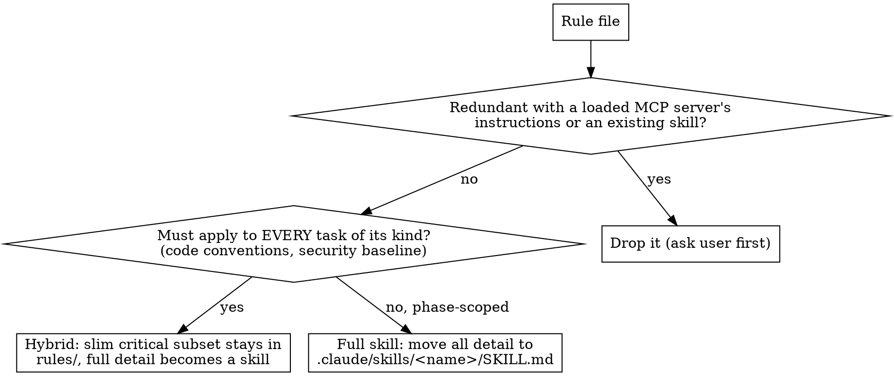

# promote-rules-to-skills

## Overview

Promote rule files from `.claude/rules/` into **skills** (`.claude/skills/<name>/SKILL.md`). A rule file only activates when something tells the agent to read it (a router link, or the agent guessing). A skill's `name` + `description` sit in the system prompt, so the model pulls the body in by task relevance on its own, and the user can run it as `/name`. For topic-shaped, detail-heavy rules that is a real upgrade; for tiny always-on rules it is not (see hybrid, below).

Companion to **optimize-agent-md**: that skill audits and splits a root config into rule files + router; this one takes the rule files further. Run it standalone too — any repo with `.claude/rules/` or dormant flat skill files qualifies.

**Scope guard — Claude Code only.** Skill auto-discovery is a Claude Code feature. Do this only for `.claude/rules/` and `.claude/skills/`. For `.agents/` (Codex) and `.gemini/` (Gemini), promoting rules makes them dormant unless you have confirmed that ecosystem auto-discovers skills the same way. When unsure, keep the rules and say so.

## When to use

- User explicitly invokes the skill name or asks to:
  - "Promote rules to skills" / "convert my rules into skills"
  - "Make my rules auto-discoverable"
  - "Revive / fix my dormant skills" (flat `.claude/skills/*.md` files that never trigger)
- User accepted the promotion offer at the end of an optimize-agent-md run.

## When NOT to use

- Auto-invocation. Manual only.
- Repo is not Claude Code (no `.claude/` tree, rules live in `.agents/` or `.gemini/`).
- User only wants the router split: that is optimize-agent-md.

## Decision per rule file



**Size gate first.** A rule file already short enough to carry no real detail (rough cut: under ~30 lines, phase-scoped) gains nothing from promotion: a skill wrapper just adds a discovery hop. Leave it as a rule. Promote only files whose detail is worth auto-triggering.

**Two forks are the user's call, not yours — ask via one batched question:**
- For each always-on discipline rule: **hybrid** vs **full skill**. Default recommend hybrid. If hybrid, also ask where the critical subset lives (usually a slimmed `rules/<x>.md`, not back in the root file).
- For each redundant rule: **drop** vs **keep as a thin skill**. Default recommend drop.

## The rules that govern the conversion

1. **Discovery format is non-negotiable.** Claude Code discovers a project skill ONLY as a directory: `.claude/skills/<name>/SKILL.md`. A flat `.claude/skills/<name>.md` is **dormant**: never listed, never auto-triggers, not `/name`-invocable. Always emit the directory form.

2. **Migrate existing flat skill files.** Before writing anything, scan `.claude/skills/` for flat `*.md` files. Each is a dormant skill. Revive it: `mkdir -p .claude/skills/<name> && git mv .claude/skills/<name>.md .claude/skills/<name>/SKILL.md` (plain `mv` if untracked). The frontmatter is usually already valid; fix the description per rule 5 if not. This is independent of any rules work: a repo with dormant flats is worth fixing on its own.

3. **Verify discovery live, same session.** After writing a `SKILL.md`, it appears in the available-skills list immediately, no restart. That is your GREEN check: confirm the new skill is listed. A flat file never appears; that is the negative control proving the dir form was required.

4. **Hybrid for always-on disciplines.** A rule that must hold on EVERY task of its kind (code conventions, security baseline) must NOT be fully skillified: if the skill fails to fire, the rule is silently skipped, which is worse than a rule that is always loaded. Keep a short critical subset in `rules/<x>.md` (stays effectively always-on via the router) and move the full detail into the skill. Phase-scoped rules (build/test commands, the review checklist) are safe to fully skillify: they only matter during that phase, so relevance-triggering is correct.

   ```
   .claude/rules/typescript.md                 # slimmed: ~20-40 lines, the non-negotiables only
   .claude/skills/ts-conventions/SKILL.md      # full detail, triggers when writing/refactoring TS
   ```

5. **Description = trigger, not workflow.** Per skill-authoring conventions, the `description` is third person, starts with "Use when…", lists concrete triggering conditions/symptoms, and NEVER summarizes the skill's process. If the repo's existing skills carry a `triggers:` list in frontmatter, generate that too, to match house style. Bad: "Use when reviewing — checks naming then types then tests." Good: "Use when writing or refactoring TypeScript/React in this repo, before committing code."

6. **Name-collision check.** Skill names share one flat namespace with plugin skills and slash commands. Before naming a skill, check for collisions (other `.claude/skills/`, installed plugin skills, `/` commands). Rename to a non-colliding, still-descriptive name: a review rule cannot become `code-review` if a `code-review` plugin / `/review` exists; use `review-checklist`.

7. **Check git tracking before claiming sharing impact.** Run `git ls-files .claude/` (or inspect `.gitignore`). If `.claude/` is gitignored, the whole tree is local-only: converting rules to skills loses no team sharing because none existed; say that. If `.claude/` IS tracked, flag that the new skills, like the old rules, will be committed and shared with the team. State the real implication for this repo; do not assume.

8. **Rewire the router.** After conversion the root file must point at the skills, not the deleted rule files, and the intro should say detail now lives in auto-triggering / `/name`-invocable skills (plus the slim hybrid subset in `rules/`). Sweep the repo for stale references to any deleted rule path and fix or flag them. Ignore dated artifacts (old plans/specs) that merely mention the old paths historically.

## Skill body shape (when promoting)

Keep the moved content; do not rewrite the rules. Wrap them in the standard skeleton:

```markdown
---
name: <kebab-name>
description: Use when <concrete triggers/symptoms — no workflow summary>
triggers:        # only if the repo's other skills use this field
  - <symptom 1>
  - <symptom 2>
---

# <Name>

## When to use
<bullets of triggering situations>

<the rule content, moved verbatim from the rule file>
```

## Common mistakes

- **Writing a flat skill file.** `.claude/skills/<name>.md` is dormant: never discovered. Always the directory form `.claude/skills/<name>/SKILL.md`. Same trap when migrating: must `mkdir` the dir, not leave the `.md` at the skills root.
- **Skipping the flat-file sweep.** A repo can already contain dormant flat skills. Detect and migrate them even if the user only asked about rules.
- **Fully skillifying an always-on rule.** If the skill does not fire, the rule is silently skipped. Use the hybrid pattern (slim subset in `rules/`, full detail in skill) for anything that must hold on every task.
- **Absorbing a redundant rule instead of dropping it.** A rule that just restates a loaded MCP server's instructions or an existing skill should be deleted, not moved into another file. Moving it keeps the duplication.
- **Promoting rules outside Claude Code.** Skill auto-discovery is Claude-specific. For `.agents/` / `.gemini/`, promotion can make rules dormant. Stay at the router unless you confirmed that ecosystem discovers skills.
- **Description that summarizes the workflow.** The model then follows the description and skips the body. Description = triggers only.
- **Promoting tiny rule files.** Under ~30 lines and phase-scoped: leave as a rule. The skill wrapper costs more discovery overhead than it saves.
- **Skipping the live-discovery check.** Writing the SKILL.md is not done; seeing it in the skills list is done.

## Deliverable shape

Final user message must contain:
1. The skills created (dir form) and any flat files migrated.
2. Which rules went hybrid vs full vs dropped, with the user's confirmation noted.
3. The live-discovery confirmation: each new skill now appears in the skills list.
4. The git-tracking finding and its real sharing implication for this repo.
5. Router rewiring summary: what the root file points at now.
6. Suggested next step: `git diff <ROOT_FILE> .claude/rules/ .claude/skills/` for review.

## Manual-only invocation

This skill is invoked manually or via the explicit offer at the end of optimize-agent-md. Do not trigger it from:
- Noticing `.claude/rules/` exists.
- Reading a rule file incidentally.
- Generic "improve my setup" requests without explicit mention of skills or rules promotion.

If unsure whether the user wants this skill, ask before running.
