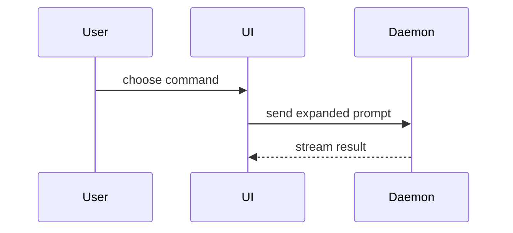

Help the user understand the current topic of conversation visually. Skip the preamble. Pick the smallest view that makes the key point clear.

### re-pitch contract (every answer)

Treat every answer as a re-pitch: the last explanation did not land, so land this one. Every answer carries all four:

1. **A description.** Two or three sentences before the visual. Say what the thing is and why it matters to the user's current question.
2. **Simple steps.** Number them. One action per step. The user follows them without reading them twice.
3. **ASD-STE100 Simplified Technical English.** Active voice. One instruction per sentence. Short, common words. Write Polish instead when the user asks for Polish.
4. **Ubiquitous language.** Take names from `CONTEXT.md` (follow `CONTEXT-MAP.md` to the right one when the repo has more than one). When the repo has no `CONTEXT.md`, take names from the ticket, then from the code.

The answer is done when the description, the steps, and the names all pass. A visual alone fails the contract.

### gather context first

Before drawing anything, pull in the context the user is talking about:

- If the conversation contains a link to a GitHub PR, get the PR together with its comments.
- If a JIRA ticket key (e.g. `SKL-1400`, `ABC-123`) or a JIRA link (e.g. `https://<org>.atlassian.net/browse/SKL-1400`) appears in the user's message, the PR title, the PR description, the branch name, or a commit message, fetch that ticket with the `getJiraIssue` tool on the Atlassian MCP server (its exact tool name varies by server, e.g. `mcp__claude_ai_Atlassian__getJiraIssue`).
- From the ticket take the summary, description, acceptance criteria, and linked issues. Use them to name things the way the ticket names them, and to show the intended target state, not only what the code does today.
- Fetch every distinct ticket you find, and fetch only keys that are present.
- When the conversation carries no ticket key, the fetch fails, or no Atlassian tool is available, say so in one line and ask the user for one of these:
  - the ticket, pasted in,
  - the requirements for this task, written out,
  - a link that holds the requirements, so you can fetch it.

  Wait for the answer. Draw the code-only view when the user tells you to continue without the requirements.

### pick a shape

- Show logic or an algorithm as pseudocode:

```text
on(save)
  if content is unchanged
    return cached result
  write new content
  return fresh result
```

- Show runtime control flow as a call tree:

```text
submitForm
  createSession
    persistPrompt
    launchAgent
  navigateToSession
```

- Show UI structure as a component tree, including state and module boundaries that matter:

```tsx
<SessionPage> (apps/example/src/routes/session.tsx)
  useSessionEvents()
  <SessionToolbar>
    <RunSkillButton> (packages/ui)
```

- Show file responsibility or a broad refactor as a shallow file tree:

```text
src/
├── commands/       # parses user actions
├── sessions/       # owns session state
└── transport/      # sends API requests
```

- Show component interaction, control flow, or data flow with Mermaid:



- Use `diff` when the point is what changes and the surrounding shape already exists. Match the diff shape to the topic.

For a component change:

```diff
 <SessionPage>
   useSessionEvents()
   <SessionToolbar>
+    <RunSkillButton />
   <SessionTimeline>
+    <SkillResultCard />
```

For a file-layout change:

```diff
 src/
 ├── commands/
+│   └── show-me.ts       # expands the slash command
 ├── sessions/
-└── transport.ts
+└── transport/
+    ├── client.ts
+    └── stream.ts
```

For a call-tree or call-stack change:

```diff
 submitForm
   createSession
     persistPrompt
+    expandSkillMention
     launchAgent
-  navigateToSession
+  navigateToSession
+    subscribeToEvents
```

For a state or control-flow change:

```diff
 on(save)
-  write content
+  if content is unchanged
+    return cached result
+  write new content
+  invalidate cache
```

- Show the whole block when most of it is new, when omitted context would hide ownership or order, or when the user needs a copyable target shape:

```ts
function expandSkill(command: string): string {
  const skillName = command.slice(1)
  return `use the ${skillName} skill`
}
```

- For a visual UI, layout, state comparison, or concept too dense for Mermaid, write one focused HTML file — a diagram, an infographic, or a short slide deck, whichever fits the point. Match the product's colors, type, spacing, and components; use real labels and data; support desktop and mobile. Then open it for the user (macOS `open`; `xdg-open` on Linux):

```
Bash(open path/to/show-me-{description}.html)
```

### guidance

Place each visual next to the short text it supports. Keep only the calls, files, props, states, and boundaries that answer the user's current question or resolve the current discussion point.

Use one shape. Use a second shape when the two show different things. Use your judgement on the rest.
